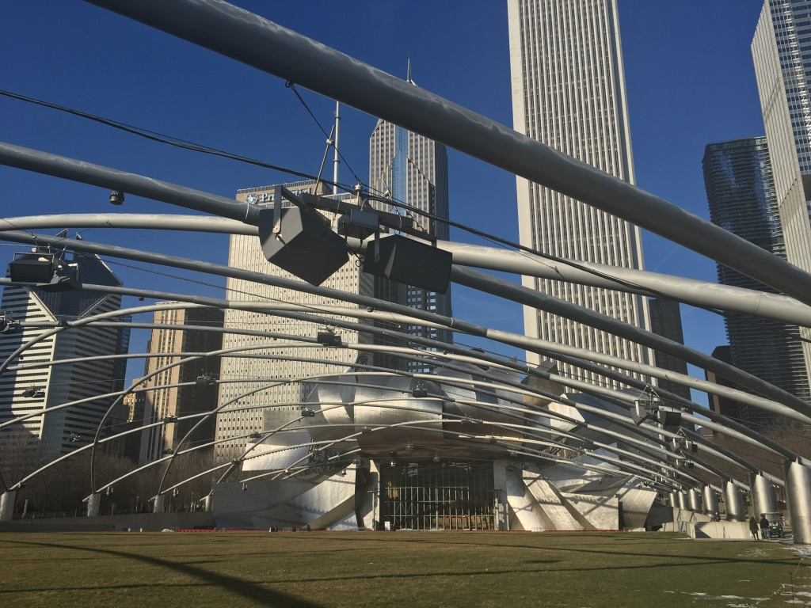
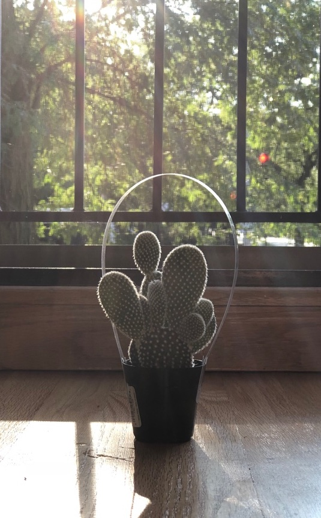

Most of these shots were taken from an iPhone 6S or the 8+. Sorted by absolutely no chronological logic whatsoever!

 

 

 

 

 

 

 

 

 

 

 

 

 

 

 

 

 

 

 

 

 

 

 

 

 

 

 

 

 

 

 

 

 

 

